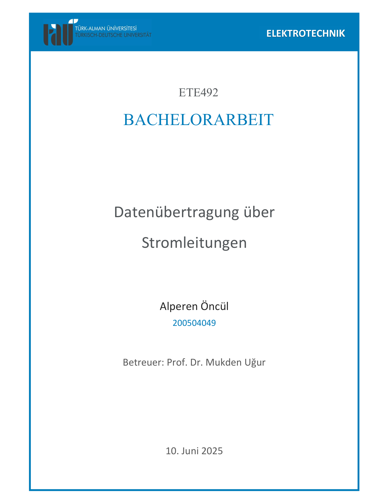
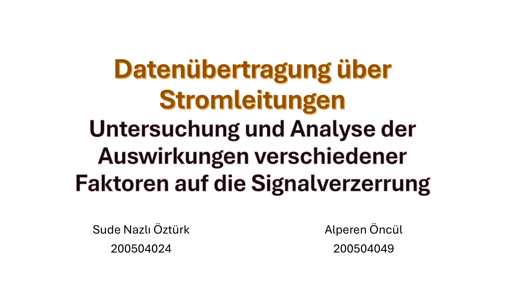

# Datenübertragung über Stromleitungen (PLC) — Thesis (Executive Summary)

**Author:** Alperen Öncül · **Email:** alperen.oncul@ieee.org

This repository contains the thesis *Datenübertragung über Stromleitungen* and a concise summary so reviewers can grasp the work without opening the PDFs. Full documents are in **docs/**. Figures below are thumbnails of the first page of each PDF.

---

## Scope and Questions
Consumer PLC (HomePlug‑AV class) enables Ethernet over AC wiring but is sensitive to **EMI**, **distance**, and **temperature**. This work asks:  
1) How do **common noise sources** (LED lighting, projector, audio gear, transformer sparks) affect latency and analog SNR? [1]  
2) How much does **distance** (~20 m) contribute vs. **receiver‑side noise**? [1]  
3) What are the **thermal limits** of a popular adapter (TP‑Link PA4010)? [2]

## Setup (Hardware & Method)
- **Adapters:** TP‑Link PA4010 (HomePlug‑AV). [1]  
- **Links:** baseline short link; then ~**20 m** separation on AC line. [1]  
- **Noise scenarios:** quiet baseline; room EMI (LED+projector+audio); **impulse noise** via transformer; **thermal soak** at ~42 °C and ~58 °C. [1][2]  
- **KPIs (digital):** RTT/throughput vs. GbE reference. [1]  
- **KPIs (analog):** **Vpp**, **RMS\_sig**, **RMS\_noise**, **LSD‑SNR**, **Shannon capacity** from 625 MSa/s captures. [1]  
- **Analysis:** MATLAB CSV pipeline for metric extraction & plots. [2]

## Key Findings (Condensed)
- **Baseline RTT** ≈ **23 ms**; **room EMI** → **~36 ms** average (**+57%**). [1]  
- **Distance (20 m)** adds only ~**4 ms**; **receiver‑side EMI** dominates the impact. [1]  
- **Thermal (~42 °C)**: Vpp ↓ ~**1 V**, estimated capacity **≈ 490 → ≈ 470 Mb/s**. **~58 °C**: failsafe (Vpp ≈ 0; SNR < 0 dB; capacity ≈ 0). [2]  
- **Impulse noise (20→80% Variac)**: LSD‑SNR **~22 → ~8 dB**; capacity **≈474 → ≈396 Mb/s** (**~16–20% drop**). [1]

## Practical Guidance
1) Prefer **clean outlets** over physically closer but noisy strips; avoid LED/SMPS clusters. [1]  
2) Ensure **airflow** around adapters; heat quickly degrades link quality; avoid enclosed AV cabinets. [2]  
3) Validate locally: sample **RTT under load** with and without suspect appliances; watch for heavy tails. [2]

## Repository Layout
- `docs/` — PDFs: **(1)** Main Report Part 1, **(2)** Main Report Part 2, **(3)** Presentation.  
- `images/` — thumbnail previews used above.  
- `README.md` — executive summary.  
- `CITATIONS.md` — bibliography and how to cite.  
- `.github/workflows/ci.yml` — CI: lists PDFs and runs Markdown link checks.

## Citations
See **[CITATIONS.md](CITATIONS.md)** for full entries and a copy‑ready citation block.